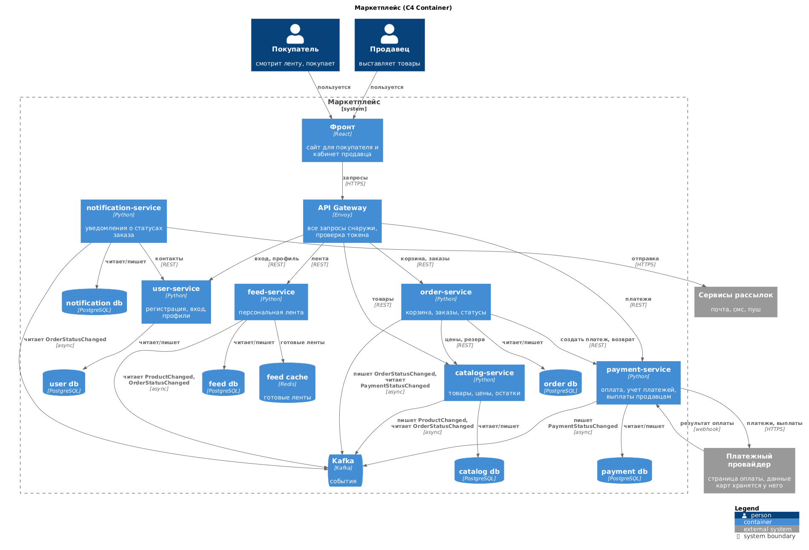

# ДЗ 1 - маркетплейс

Архитектура маркетплейса + один сервис в докере (catalog-service). бизнес логики нет, сервис только отвечает на /health

## Как запустить

нужен докер

```
docker compose up --build
```

после этого открыть http://localhost:8000/health в браузере или

```
curl http://localhost:8000/health
```

должно вернуть 200 и `{"status":"ok"}`

можно и без compose:

```
docker build -t catalog ./catalog-service
docker run -p 8000:8000 catalog
```

## Диаграмма

C4 Container, рисовал в plantuml (исходник в c4.puml)



где на стрелке написано async это события через Kafka, все остальное обычные синхронные запросы (REST или запросы в базу)

## Что я предположил

в задании нет никаких цифр поэтому исходил из такого:
- покупателей намного больше чем продавцов, и ленту открывают гораздо чаще чем что то покупают
- алгоритм ленты будут постоянно менять и пробовать новое
- над проектом работает несколько команд
- оплата картой через внешний платежный провайдер, данные карт у себя не храним
- доставку, отзывы и тд не делаю, этого нет в задании. статус "передан в доставку" продавец ставит сам

## Домены

поделил по тем функциям которые есть в задании:
- пользователи - регистрация, вход, профили покупателей и продавцов
- каталог - товары, категории, цены и остатки. продавец сам управляет своими товарами
- лента - персональная подборка товаров для покупателя
- заказы - корзина, оформление заказа, статусы заказа
- платежи - считает сумму и комиссию маркетплейса, проводит оплату через платежного провайдера, ведет учет платежей и выплат продавцам
- уведомления - отправляет покупателю и продавцу сообщения о статусах заказа (почта, смс, пуш)

персонализацию сделал простую без всякого ML: в ленте товары из категорий, которые человек смотрел или покупал плюс то что сейчас популярно у всех. если потом захочется что-то умнее это поменяется только внутри ленты

## Сервисы и почему так поделил

по сути один домен = один сервис:
- user-service - пользователи
- catalog-service - каталог
- feed-service - лента
- order-service - заказы
- payment-service - платежи
- notification-service - уведомления

плюс API Gateway (Envoy) через него идут все запросы снаружи и там же проверяется токен. И Kafka для событий между сервисами

Ленту вынес отдельно потому что ее открывают постоянно и алгоритм часто меняют. ее нужно отдельно масштабировать и выкатывать хоть каждый день, не трогая платежи и заказы. Если лента упадет, заказы все равно можно оформить

платежи отдельно потому что там чувствительные данные и интеграция с внешним провайдером (как в примере с Payment на лекции). к этим данным должен иметь доступ только один сервис а не вся система

уведомления тоже отдельно, они просто слушают события. если они упадут или сервис рассылок затупит оформление заказа этого даже не заметит

А вот корзину отдельно выносить не стал. она при оформлении превращается в заказ, позиции у них одни и те же, если их разнести то на каждое оформление будет лишний запрос по сети. Цены и остатки тоже оставил в каталоге, продавец меняет их вместе с карточкой товара, а для резерва под заказ нужно и то и другое сразу. В общем старался держать вместе то что меняется вместе (на лекции это cohesion)

## Данные

У каждого сервиса своя база и в чужую базу никто не лезет. если нужны чужие данные, то только через api этого сервиса или через события. Общей базы нет, иначе получится распределенный монолит про который говорили на лекции

кто чем владеет и за что отвечает:
- user-service (PostgreSQL) - учетки, хеши паролей, роли, профили, контакты. отвечает за регистрацию, вход и выдачу токена
- catalog-service (PostgreSQL) - товары, категории, цены, остатки, резервы под заказы. отвечает за каталог и резерв остатков
- feed-service (PostgreSQL + Redis) - копия товаров для ленты и интересы покупателей, в Redis лежат уже готовые ленты чтобы не собирать их на каждый запрос. отвечает за то чтобы собрать и отдать ленту
- order-service (PostgreSQL) - корзины, заказы, позиции заказов и история статусов. отвечает за оформление и статусы
- payment-service (PostgreSQL) - платежи, возвраты, комиссии, выплаты продавцам, реквизиты продавцов. отвечает за оплату и учет денег
- notification-service (PostgreSQL) - шаблоны и история отправленных уведомлений. отвечает за отправку уведомлений

еще пара моментов:
- в ленте лежит копия товаров, а в заказе копия цены и названия товара. это только копии для чтения, главный источник все равно каталог. ленте копия нужна чтобы не ходить в каталог на каждый показ, а заказу чтобы цена потом не поменялась
- данных карт у нас вообще нет, человек вводит их на странице провайдера, у нас только id платежа и статус
- своя база не значит свой сервер. на старте можно держать несколько баз на одном PostgreSQL, главное что у каждого сервиса свой пользователь и доступа в чужую базу у него нет

## Как сервисы общаются

правило такое: синхронно (REST) только там где пользователь ждет ответ прямо сейчас и без него дальше никак. Все остальное через Kafka событиями, тогда сервисам не надо ждать друг друга и если кто-то лежит событие просто его подождет

синхронно:
- фронт -> gateway -> user, catalog, feed, order, payment. это все запросы от клиента
- order -> catalog. при оформлении взять актуальные цены и зарезервировать остатки
- order -> payment. создать платеж и получить ссылку на оплату, ну и возврат если что
- payment -> платежный провайдер. создать платеж или выплату продавцу. обратно провайдер сам присылает результат оплаты (webhook)
- notification -> user. взять контакты кому отправлять
- notification -> сервисы рассылок. отправить письмо, смс или пуш

асинхронно через Kafka:
- catalog пишет ProductChanged (товар добавили, поменяли или удалили), его читает feed и обновляет свою копию
- payment пишет PaymentStatusChanged (оплата прошла или нет), его читает order
- order пишет OrderStatusChanged, его читают notification (отправить уведомление), feed (учесть покупку) и catalog (если заказ отменили, вернуть остаток)

как выглядит оформление заказа:
1. покупатель жмет "оформить", запрос через gateway приходит в order-service
2. order идет в catalog, берет цены и резервирует остатки. если чего-то нет сразу ошибка
3. order создает заказ в статусе "ждет оплаты"
4. order идет в payment, тот создает платеж у провайдера и отдает ссылку на оплату
5. человек платит на странице провайдера
6. результат приходит в payment, он кидает PaymentStatusChanged
7. order ставит заказу "оплачен" или "отменен" и кидает OrderStatusChanged
8. дальше уведомления отправляют сообщение, лента учитывает покупку, а если заказ отменили каталог возвращает остаток

если оплаты нет 15 минут или payment вообще не ответил, order сам отменяет заказ и дальше как в 8 пункте. Одной общей транзакции на все это нет потому что у каждого своя база, поэтому заказ просто живет по статусам и если что-то пошло не так мы откатываем назад (снимаем резерв)

## Какие варианты рассматривал

### Вариант 1. Модульный монолит

одно приложение, внутри модули по тем же доменам. одна база (у каждого модуля свои таблицы), деплоится все целиком

плюсы:
- проще и дешевле. одно приложение, одна база, кафка не нужна
- нет задержек по сети между модулями
- резерв остатка и создание заказа делаются в одной транзакции, не бывает такого что остаток зарезервировали а заказ не создался
- проще тестировать и мониторить

минусы:
- ленту нельзя масштабировать отдельно. ее открывают постоянно, а масштабировать придется все приложение целиком
- любое изменение ленты это выкатка всего маркетплейса вместе с платежами. и если в ленте баг (например утекает память) может лечь и оформление заказов
- платежные данные лежат в одном приложении и одной базе со всем остальным
- несколько команд в одном коде будут мешать друг другу с релизами

### Вариант 2. Микросервисы по доменам (то что на диаграмме)

6 сервисов, у каждого своя база, общаются по REST и через Kafka

плюсы:
- каждый сервис выкатывается отдельно, ленту можно менять хоть каждый день
- масштабировать можно только то что реально нагружено (лента, каталог)
- если упал один сервис остальные работают. упала лента - заказы оформляются, упали уведомления - события подождут в кафке
- к платежным данным доступ только у payment-service
- каждая команда отвечает за свои сервисы и не мешает другим

минусы:
- нет одной транзакции на оформление заказа, приходится жить со статусами и откатами
- сеть может тормозить и падать, нужны таймауты и повторы. при оформлении 2 запроса по сети вместо простого вызова функции
- данные в ленте обновляются не сразу, а через пару секунд
- надо следить за контрактами апи и событий, просто так их менять нельзя а то сломаются соседи
- сложнее мониторить, нужны метрики и логи с каждого сервиса и общий id запроса чтобы понять где он упал
- дороже, больше всего надо поднимать и поддерживать

### Еще думал про совсем мелкое разбиение

порезать еще мельче: отдельно корзина, цены, остатки, возвраты, почта, смс и тд, сервисов 15-20. плюс тут только в том что каждый сервис совсем маленький и масштабировать можно прям точечно. Но тогда оформление заказа превращается в цепочку из кучи синхронных вызовов (корзина -> товар -> цена -> остаток -> заказ -> платеж), задержки складываются и если любой из них лежит заказ не оформить. Плюс, то что меняется вместе разъезжается по разным сервисам и связей между ними становится только больше, на лекции это было как плохо выбранные границы. поэтому сильно его не расписывал

## Что выбрал и почему

выбрал второй вариант. если пройтись по тому что нужно в задании:
- персональная лента. это самая нагруженная часть и ее будут часто менять, значит ей нужен свой сервис чтобы масштабировать и выкатывать ее отдельно. в монолите так не выйдет
- расчет и учет платежей. там чувствительные данные и внешний провайдер, лучше это изолировать чтобы доступ к данным был только у одного сервиса
- уведомления о статусах. они не должны влиять на оформление заказа, поэтому отдельный сервис который просто слушает события
- каталог для продавцов и оформление заказов. у них разные пользователи и разная нагрузка (каталог смотрят все, а заказы делают реже), поэтому тоже раздельно. но внутри держу вместе то что меняется вместе, поэтому не мелкое разбиение

минусы второго варианта понимаю: нет общей транзакции, лента немного отстает и поддерживать это все дороже. но транзакцию заменяют статусы заказа, а отставание ленты на пару секунд вообще не критично

честно если бы это делала одна маленькая команда и нагрузки было мало, я бы начал с монолита, микросервисы стоят дороже. Но тут с самого начала есть части с очень разной нагрузкой, платежные данные и несколько команд, поэтому сразу микросервисы

## Какие решения принял

- у каждого сервиса своя база, в чужую не ходим
- снаружи все запросы только через gateway
- данные карт у себя не храним
- синхронно только когда пользователь ждет ответ, все остальное через кафку
- копии чужих данных только для чтения, менять данные может только их хозяин

## Что сделано

catalog-service на Python (FastAPI). бизнес логики нет, есть только GET /health который отдает 200 и {"status":"ok"}. Поднимать можно было любой сервис, взял каталог потому что он ни от кого синхронно не зависит и спокойно поднимается сам по себе
